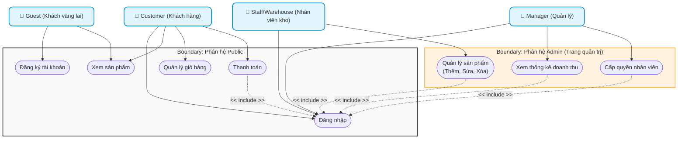
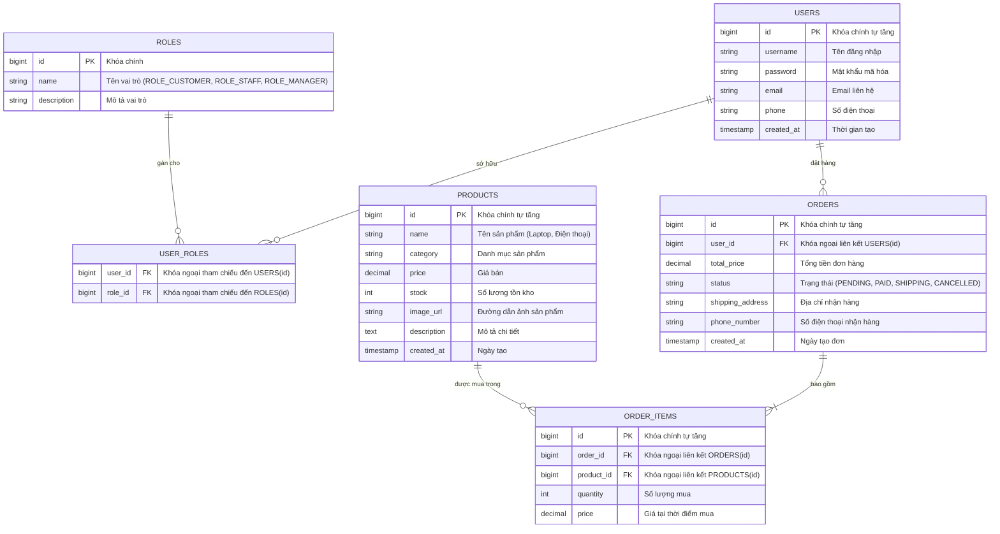

# SƠ ĐỒ HỆ THỐNG TECHNOVA (USE CASE & ERD)

Tài liệu này chứa mã nguồn Mermaid.js cho sơ đồ Use Case và sơ đồ Thực thể Kết nối (ERD) của hệ thống thương mại điện tử TechNova.

---

## 1. Sơ đồ Use Case Tổng quan (Use Case Diagram)

Sơ đồ này thể hiện mối quan hệ giữa các Actor (Guest, Customer, Staff/Warehouse, Manager) và các ca sử dụng cốt lõi, được phân vùng (Boundary) rõ ràng giữa phân hệ **Public** và phân hệ **Admin**.

---

## 2. Sơ đồ Thực thể Kết nối (ERD - Entity Relationship Diagram)

Thiết kế cơ sở dữ liệu quan hệ cho các bảng cốt lõi của hệ thống bao gồm: `Users`, `Roles`, `User_Roles`, `Products`, `Orders` và `Order_Items`. Mối quan hệ giữa `Users` và `Roles` là nhiều-nhiều (N-N) thông qua bảng trung gian `User_Roles`.

