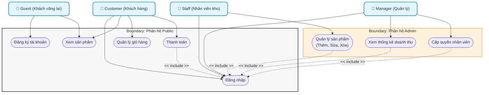
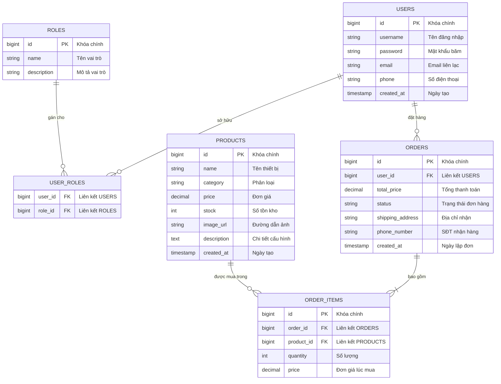

# TÀI LIỆU ĐẶC TẢ YÊU CẦU PHẦN MỀM (SRS)
## HỆ THỐNG THƯƠNG MẠI ĐIỆN TỬ TECHNOVA (SMART E-SHOP - SHOP AI)

* **Chuẩn áp dụng:** IEEE Std 830-1998
* **Vai trò biên soạn:** Senior Business Analyst / Technical Writer
* **Trạng thái:** Hoàn chỉnh (Bản cuối dùng để xuất PDF)
* **Phiên bản:** 1.0
* **Ngày lập:** 03/07/2026

---

## 1. Introduction (Giới thiệu)

### 1.1 Purpose (Mục đích)
Tài liệu Đặc tả Yêu cầu Phần mềm (SRS) này mô tả chi tiết các yêu cầu chức năng (FR) và phi chức năng (NFR) cho hệ thống thương mại điện tử "Smart E-Shop (Shop AI)" của công ty bán lẻ điện tử TechNova. Tài liệu này đóng vai trò làm cơ sở thống nhất giữa ban lãnh đạo TechNova, bộ phận nghiệp vụ và đội ngũ phát triển phần mềm (Developers, Testers, DevOps) để triển khai xây dựng hệ thống.

### 1.2 Project Scope (Phạm vi dự án)
Dự án tập trung xây dựng một nền tảng Web thương mại điện tử hiện đại, cho phép TechNova tiếp cận khách hàng trực tuyến và tối ưu quy trình quản trị nội bộ. 
* **Hệ thống bao gồm:**
  * **Phân hệ Client (Public Portal):** Dành cho khách hàng xem sản phẩm công nghệ (điện thoại, laptop), đăng ký tài khoản, đăng nhập, quản lý giỏ hàng và thực hiện thanh toán trực tuyến.
  * **Phân hệ Admin (Admin Portal):** Dành cho nhân viên kho quản lý danh mục hàng hóa và quản lý cấp cao theo dõi báo cáo doanh thu cũng như cấu hình phân quyền nhân sự.
* **Hệ thống nằm ngoài phạm vi (Out of Scope):** Quy trình xử lý logistics chặng cuối (giao hàng thực tế), quản lý chuỗi cung ứng nhà sản xuất, và các nghiệp vụ kế toán thuế chuyên sâu.

### 1.3 Definitions, Acronyms, and Abbreviations (Thuật ngữ và viết tắt)
* **SRS:** Software Requirements Specification (Đặc tả yêu cầu phần mềm).
* **IEEE:** Institute of Electrical and Electronics Engineers (Viện kỹ sư Điện và Điện tử).
* **FR:** Functional Requirement (Yêu cầu chức năng).
* **NFR:** Non-functional Requirement (Yêu cầu phi chức năng).
* **RBAC:** Role-Based Access Control (Kiểm soát truy cập dựa trên vai trò).
* **JWT:** JSON Web Token (Phương thức xác thực phiên làm việc dạng chuỗi mã hóa).
* **RPS:** Requests Per Second (Số lượng yêu cầu xử lý mỗi giây).
* **COD:** Cash on Delivery (Thanh toán khi nhận hàng).
* **DB:** Database (Cơ sở dữ liệu).

### 1.4 References (Tài liệu tham khảo)
* IEEE Std 830-1998, IEEE Recommended Practice for Software Requirements Specifications.
* Biên bản họp nghiệp vụ ngày 02/07/2026 giữa Ban giám đốc TechNova và đội ngũ BA.

### 1.5 Document Overview (Tổng quan tài liệu)
Tài liệu gồm 5 chương chính: Chương 1 giới thiệu mục đích và phạm vi; Chương 2 mô tả bối cảnh và các ràng buộc chung; Chương 3 đi sâu chi tiết các yêu cầu chức năng thông qua các bảng luồng nghiệp vụ chuẩn hóa; Chương 4 đặc tả yêu cầu phi chức năng về bảo mật, hiệu năng, tải trọng; Chương 5 cung cấp trực quan hóa bằng mã nguồn sơ đồ Use Case và ERD dạng Mermaid.

---

## 2. Overall Description (Mô tả tổng quan)

### 2.1 Product Perspective (Bối cảnh sản phẩm)
Hệ thống Smart E-Shop là một hệ thống web độc lập hoạt động theo mô hình Client-Server. Hệ thống sẽ tích hợp với các cổng thanh toán trực tuyến của bên thứ ba để hoàn tất chu kỳ mua sắm trực tuyến. Hệ thống được triển khai trên hạ tầng điện toán đám mây để đảm bảo tính sẵn sàng cao và khả năng co giãn tự động.

### 2.2 Product Functions (Các tính năng cốt lõi)
Hệ thống cung cấp các khối chức năng chính sau:
1. **Xác thực và phân quyền:** Đăng ký, đăng nhập an toàn bằng mã hóa mật khẩu và cơ chế JWT. Phân quyền chặt chẽ giữa khách hàng và các cấp độ nhân viên admin.
2. **Quản lý danh mục sản phẩm trực tuyến:** Cho phép tìm kiếm, lọc và xem thông tin chi tiết các thiết bị điện tử.
3. **Quy trình mua sắm trực tuyến:** Quản lý giỏ hàng động và thực hiện thủ tục đặt hàng, thanh toán trực tuyến.
4. **Quản lý kho hàng (Admin):** Thêm, sửa, xóa sản phẩm và số lượng tồn kho.
5. **Giám sát & Quản trị hệ thống (Manager):** Báo cáo trực quan doanh thu bán hàng và thiết lập vai trò người dùng trong trang quản trị.

### 2.3 User Classes and Characteristics (Tác nhân hệ thống)
* **Khách vãng lai (Guest):** Nhóm người dùng chưa có tài khoản hoặc chưa đăng nhập. Chỉ có quyền xem sản phẩm và đăng ký tài khoản.
* **Khách hàng (Customer):** Nhóm người dùng đã xác thực. Có toàn quyền quản lý giỏ hàng cá nhân, tiến hành đặt hàng, thanh toán và xem lịch sử mua sắm.
* **Nhân viên kho (Warehouse Staff):** Nhân viên vận hành kỹ thuật. Có kiến thức cơ bản về quản lý danh mục sản phẩm, chỉ được truy cập các chức năng nhập kho hàng trên Admin.
* **Quản lý (Manager):** Người dùng có quyền cao nhất trên hệ thống, chịu trách nhiệm theo dõi báo cáo tài chính trực quan và có chuyên môn phân quyền nhân viên.

### 2.4 Design and Implementation Constraints (Ràng buộc thiết kế và triển khai)
* **Công nghệ phát triển:** Sử dụng mô hình Single Page Application (SPA) cho Frontend và RESTful API cho Backend.
* **Hệ cơ sở dữ liệu:** Sử dụng hệ quản trị cơ sở dữ liệu quan hệ (RDBMS) mạnh mẽ như PostgreSQL hoặc MySQL, có hỗ trợ Clustering.
* **Trình duyệt hỗ trợ:** Tương thích tốt trên toàn bộ các trình duyệt hiện đại (Chrome, Safari, Edge, Firefox).

### 2.5 Assumptions and Dependencies (Giả định và phụ thuộc)
* **Giả định:** Người dùng truy cập hệ thống bằng thiết bị có kết nối mạng Internet ổn định.
* **Phụ thuộc:** Hệ thống phụ thuộc vào sự ổn định của API cổng thanh toán bên thứ ba (Momo/VNPay) để thực hiện giao dịch thanh toán trực tuyến. Nếu các cổng này gặp sự cố, luồng thanh toán online sẽ tạm thời gián đoạn.

---

## 3. Specific Requirements (Yêu cầu chức năng chi tiết)

Dưới đây là các bảng đặc tả yêu cầu chức năng (Use Case) cốt lõi của hệ thống:

### 3.1 Nhóm chức năng: Khách hàng (Customer)

#### FR-01: Đăng ký tài khoản mới (Register)
| Thuộc tính | Chi tiết mô tả |
| :--- | :--- |
| **Actor** | Guest (Khách vãng lai) |
| **Pre-condition** | Người dùng chưa có tài khoản trên hệ thống và đang ở trang Đăng ký. |
| **Post-condition** | Tài khoản mới được tạo thành công trong DB; người dùng được tự động chuyển đến trang Đăng nhập. |
| **Main Flow (Luồng chính)** | 1. Người dùng nhập thông tin: Họ tên, Email, Số điện thoại, Mật khẩu và Xác nhận mật khẩu. 2. Người dùng nhấn nút "Đăng ký". 3. Hệ thống kiểm tra định dạng email/SĐT hợp lệ và đảm bảo thông tin chưa từng tồn tại trên hệ thống. 4. Hệ thống thực hiện băm mật khẩu (hashing) và ghi nhận tài khoản vào cơ sở dữ liệu. 5. Hệ thống hiển thị thông báo "Đăng ký thành công". |
| **Alternative Flow (Luồng rẽ nhánh)** | * **3a. Trùng lặp thông tin:** Nếu Email hoặc Số điện thoại đã tồn tại, hệ thống báo lỗi: "Tài khoản đã tồn tại trên hệ thống" và giữ lại các thông tin cũ để người dùng chỉnh sửa. * **3b. Mật khẩu yếu:** Nếu mật khẩu không đáp ứng độ dài tối thiểu 8 ký tự hoặc thiếu ký tự đặc biệt, hệ thống báo lỗi: "Mật khẩu không đủ mạnh". |

#### FR-02: Đăng nhập hệ thống (Login)
| Thuộc tính | Chi tiết mô tả |
| :--- | :--- |
| **Actor** | Guest, Customer, Warehouse Staff, Manager |
| **Pre-condition** | Người dùng đã có tài khoản và ở trang Đăng nhập. |
| **Post-condition** | Hệ thống tạo chuỗi JWT token; người dùng truy cập được vào phân hệ tương ứng với vai trò của mình. |
| **Main Flow (Luồng chính)** | 1. Người dùng nhập Email/SĐT và Mật khẩu. 2. Người dùng nhấn "Đăng nhập". 3. Hệ thống truy vấn thông tin user trong DB và so khớp mật khẩu đã mã hóa. 4. Xác thực thành công: Hệ thống sinh mã JWT chứa thông tin định danh và vai trò (Role), trả về cho Client lưu vào bộ nhớ an toàn. 5. Hệ thống điều hướng người dùng dựa trên vai trò:    - Khách hàng: chuyển về trang chủ hoặc giỏ hàng.    - Nhân viên/Quản lý: chuyển hướng sang trang quản trị Admin Portal. |
| **Alternative Flow (Luồng rẽ nhánh)** | * **3a. Sai thông tin:** Nếu nhập sai tài khoản hoặc mật khẩu, hệ thống hiển thị thông báo chung: "Thông tin đăng nhập không chính xác" (không chỉ rõ sai ở trường nào để bảo mật). |

#### FR-03: Xem chi tiết sản phẩm (Browse/View Product Details)
| Thuộc tính | Chi tiết mô tả |
| :--- | :--- |
| **Actor** | Guest, Customer |
| **Pre-condition** | Người dùng truy cập trang chủ hoặc trang danh mục sản phẩm. |
| **Post-condition** | Chi tiết thông tin sản phẩm và trạng thái tồn kho thực tế được hiển thị đầy đủ trên màn hình. |
| **Main Flow (Luồng chính)** | 1. Người dùng cuộn trang danh sách sản phẩm hoặc nhập từ khóa tìm kiếm (ví dụ: "iPhone 15", "Dell XPS"). 2. Người dùng nhấn vào hình ảnh hoặc tên sản phẩm mong muốn. 3. Hệ thống gửi yêu cầu lấy dữ liệu chi tiết (được tối ưu hóa qua Redis Cache nếu có sẵn). 4. Hệ thống kết xuất thông tin: Tên sản phẩm, hình ảnh chi tiết, giá tiền, mô tả kỹ thuật, đánh giá và số lượng còn lại trong kho. |

#### FR-04: Quản lý giỏ hàng (Shopping Cart Management)
| Thuộc tính | Chi tiết mô tả |
| :--- | :--- |
| **Actor** | Guest, Customer |
| **Pre-condition** | Người dùng đang xem sản phẩm hoặc trang giỏ hàng. |
| **Post-condition** | Giỏ hàng lưu trữ thông tin sản phẩm và số lượng mua của người dùng được cập nhật liên tục. |
| **Main Flow (Luồng chính)** | 1. Người dùng nhấn nút "Thêm vào giỏ hàng" tại trang sản phẩm. 2. Hệ thống kiểm tra số lượng tồn kho khả dụng. 3. Nếu đáp ứng, hệ thống thêm sản phẩm vào giỏ hàng động (lưu tạm LocalStorage với Guest hoặc lưu DB/Redis với Customer đã đăng nhập). 4. Người dùng có thể tăng/giảm số lượng sản phẩm trực tiếp trong giỏ hàng, hệ thống tự động tính lại tổng tiền. |
| **Alternative Flow (Luồng rẽ nhánh)** | * **2a. Hết hàng:** Nếu số lượng mua lớn hơn số lượng tồn kho khả dụng, hệ thống thông báo: "Sản phẩm hiện tại không đủ số lượng trong kho". |

#### FR-05: Đặt hàng và Thanh toán (Checkout & Payment)
| Thuộc tính | Chi tiết mô tả |
| :--- | :--- |
| **Actor** | Customer (Khách hàng bắt buộc đã đăng nhập) |
| **Pre-condition** | Khách hàng đã đăng nhập, giỏ hàng có ít nhất một sản phẩm hợp lệ. |
| **Post-condition** | Đơn hàng được khởi tạo thành công với trạng thái phù hợp; số lượng tồn kho của sản phẩm giảm đi tương ứng; giỏ hàng của khách hàng được làm trống. |
| **Main Flow (Luồng chính)** | 1. Khách hàng nhấn "Tiến hành thanh toán" từ trang giỏ hàng. 2. Hệ thống chuyển hướng yêu cầu đăng nhập nếu phiên làm việc chưa xác thực. 3. Khách hàng điền thông tin giao hàng: Họ tên, Số điện thoại nhận hàng, Địa chỉ giao hàng. 4. Khách hàng lựa chọn phương thức thanh toán: Online (Momo/VNPay) hoặc COD. 5. Khách hàng nhấn "Đặt hàng". Hệ thống lock tạm thời số lượng sản phẩm trong DB để tránh tranh chấp (Race Condition). 6. Nếu chọn Thanh toán Online: Hệ thống điều hướng sang cổng thanh toán, chờ phản hồi trạng thái từ API cổng thanh toán. 7. Đơn hàng tạo thành công: Hệ thống gửi email xác nhận cho khách hàng, trừ số lượng tồn kho thực tế, lưu đơn vào trạng thái "Chờ xử lý" (hoặc "Đã thanh toán"). |
| **Alternative Flow (Luồng rẽ nhánh)** | * **6a. Giao dịch online thất bại:** Nếu cổng thanh toán trả về mã lỗi (khách hủy giao dịch, tài khoản không đủ số dư), hệ thống đưa người dùng quay lại trang thanh toán kèm thông báo: "Thanh toán thất bại, vui lòng thử lại hoặc chọn COD" và giữ nguyên giỏ hàng. |

---

### 3.2 Nhóm chức năng: Nhân viên kho (Warehouse Staff)

#### FR-06: Quản lý sản phẩm (Product Catalog Management)
| Thuộc tính | Chi tiết mô tả |
| :--- | :--- |
| **Actor** | Warehouse Staff (Nhân viên kho) |
| **Pre-condition** | Nhân viên kho đã đăng nhập thành công vào trang quản trị Admin Portal. |
| **Post-condition** | Thông tin danh mục sản phẩm trong cơ sở dữ liệu được cập nhật (Thêm mới, Chỉnh sửa thông tin, hoặc Ẩn/Xóa sản phẩm). |
| **Main Flow (Luồng chính)** | 1. Nhân viên truy cập tab "Quản lý sản phẩm". 2. Hệ thống hiển thị danh sách các sản phẩm đang kinh doanh. 3. **Trường hợp thêm mới (Create):** Nhân viên điền thông số (Tên sản phẩm, Danh mục, Giá bán, Mô tả, Tồn kho ban đầu, Tải ảnh lên), hệ thống validate dữ liệu đầu vào và lưu sản phẩm mới. 4. **Trường hợp chỉnh sửa (Update):** Nhân viên cập nhật thông tin mới trên form chi tiết sản phẩm, hệ thống lưu đè thông tin mới trong DB. 5. **Trường hợp xóa (Delete):** Nhân viên nhấn nút xóa, hệ thống kiểm tra sản phẩm có đơn hàng liên quan không. Nếu không, xóa khỏi DB; nếu có đơn hàng liên quan, hệ thống thực hiện Soft Delete (ẩn sản phẩm) để giữ lịch sử giao dịch. |

---

### 3.3 Nhóm chức năng: Quản lý (Manager)

#### FR-07: Xem báo cáo thống kê doanh thu (Revenue Reporting)
| Thuộc tính | Chi tiết mô tả |
| :--- | :--- |
| **Actor** | Manager (Quản lý) |
| **Pre-condition** | Quản lý đã đăng nhập thành công vào trang quản trị Admin Portal. |
| **Post-condition** | Báo cáo doanh thu và biểu đồ phân tích hiển thị chính xác theo tham số thời gian được chọn. |
| **Main Flow (Luồng chính)** | 1. Quản lý truy cập tab "Báo cáo doanh thu". 2. Quản lý chọn bộ lọc thời gian (Hôm nay, Tuần này, Tháng này, hoặc khoảng thời gian tùy chọn từ ngày A đến ngày B). 3. Hệ thống thực hiện các câu lệnh query tổng hợp dữ liệu từ bảng `orders` và `order_items` trong cơ sở dữ liệu. 4. Hệ thống hiển thị: Tổng doanh thu, Số lượng đơn hàng thành công, Biểu đồ doanh thu theo thời gian, Danh mục sản phẩm bán chạy nhất. |

#### FR-08: Phân quyền nhân viên (Role Assignment)
| Thuộc tính | Chi tiết mô tả |
| :--- | :--- |
| **Actor** | Manager (Quản lý) |
| **Pre-condition** | Quản lý đăng nhập vào trang quản trị Admin Portal với quyền tối cao (Super Admin/Manager). |
| **Post-condition** | Vai trò của tài khoản nhân viên được cập nhật chính xác trong DB; quyền truy cập hệ thống của tài khoản đó thay đổi ngay lập tức. |
| **Main Flow (Luồng chính)** | 1. Quản lý truy cập tab "Quản lý nhân viên". 2. Hệ thống hiển thị danh sách tài khoản nhân viên kèm theo Vai trò hiện tại. 3. Quản lý chọn tài khoản cụ thể cần phân quyền và click "Chỉnh sửa vai trò". 4. Quản lý chọn vai trò mới từ danh sách thả xuống (Ví dụ: Chuyển đổi từ tài khoản thường sang vai trò "Nhân viên kho"). 5. Quản lý nhấn "Lưu". Hệ thống cập nhật bảng liên kết `user_roles` trong DB. 6. Hệ thống thực hiện thu hồi/làm mới JWT Token của nhân viên đó khi họ thực hiện thao tác kế tiếp để áp dụng quyền hạn mới. |

---

## 4. Non-functional Requirements (Yêu cầu phi chức năng)

Để hệ thống vận hành trơn tru và đáp ứng được lưu lượng truy cập lớn lên tới hàng chục ngàn người truy cập đồng thời mà không bị sập hay rò rỉ dữ liệu, các tiêu chí phi chức năng dưới đây phải được thực thi nghiêm ngặt tại tầng kiến trúc:

### 4.1 Security Requirements (Tiêu chí Bảo mật)
* **Xác thực JWT (JSON Web Token Security):**
  * Sử dụng chữ ký số bảo mật thuật toán HMAC SHA-256 (hoặc RS256) với mã khóa bí mật (Secret Key) được lưu trữ an toàn trong biến môi trường (Environment Variable) của Server.
  * Thiết lập thời gian hết hạn (Expiration Time) ngắn cho Access Token (15 - 30 phút) kết hợp với cơ chế Refresh Token (lưu trữ trong Cookie HttpOnly, Secure, SameSite=Strict) để cấp lại Access Token tự động mà không bắt người dùng phải đăng nhập lại liên tục.
* **Kiểm soát truy cập dựa trên vai trò (RBAC):**
  * Toàn bộ API endpoint thuộc trang quản trị (`/api/v1/admin/**`) phải đi qua một bộ lọc Middleware/Security Filter để kiểm tra vai trò của người dùng nằm trong payload của JWT Token.
  * Nếu JWT không chứa vai trò `ROLE_STAFF` hoặc `ROLE_MANAGER`, API lập tức phản hồi mã lỗi `403 Forbidden`. Khách hàng hoàn toàn không thể gọi API admin dù có đổi thủ công đường dẫn URL trên trình duyệt.
* **Bảo vệ dữ liệu cá nhân:**
  * Mã hóa mật khẩu lưu trong DB bằng thuật toán Bcrypt với mức độ phức tạp (Work Factor/Strength) là 12 để ngăn chặn tấn công vét cạn (Brute-force).

### 4.2 Performance Requirements (Tiêu chí Hiệu năng)
* **Tốc độ phản hồi API:**
  * Thời gian phản hồi (Response Latency) cho các API truy vấn thông tin sản phẩm, tìm kiếm phải nhỏ hơn hoặc bằng $200ms$ cho $95\%$ số lượng request ($p95$).
  * Đối với các API liên quan đến thao tác ghi dữ liệu nặng (Thêm sản phẩm, Đặt hàng), thời gian phản hồi phải dưới $1000ms$.
* **Chiến lược bộ nhớ đệm (Caching):**
  * Cài đặt máy chủ bộ nhớ đệm Redis để lưu thông tin sản phẩm tĩnh, danh mục sản phẩm. Khi khách hàng duyệt xem sản phẩm, API Backend sẽ lấy dữ liệu từ Redis thay vì truy vấn trực tiếp vào Database. Dữ liệu trong Redis được thiết lập thời gian sống (TTL - Time to Live) là 2 giờ và được xóa/làm mới ngay khi nhân viên kho cập nhật thông tin sản phẩm tương ứng.
* **Tối ưu hóa Database Queries:**
  * Toàn bộ các bảng phải được cấu hình Index hợp lý trên các cột tìm kiếm và liên kết khóa ngoại.
  * Ngăn chặn hoàn toàn lỗi truy vấn kinh điển $N+1$ bằng cách áp dụng kỹ thuật Fetch Join hoặc Eager Loading thích hợp trong mã nguồn ứng dụng.

### 4.3 Scalability & Reliability (Khả năng mở rộng & Xử lý tải đồng thời)
* **Xử lý tải đồng thời (Concurrency Handling):**
  * Hệ thống thiết kế để hỗ trợ tối thiểu **10,000 người dùng hoạt động đồng thời (Concurrent Users)** và đáp ứng từ **2,000 đến 5,000 Requests Per Second (RPS)**.
  * Sử dụng cơ chế khóa lạc quan (Optimistic Locking) với thuộc tính phiên bản `@Version` trên bảng `Products` để xử lý tranh chấp hàng tồn kho khi có hàng ngàn khách hàng cùng nhấn thanh toán một sản phẩm tại một thời điểm (Race Condition). Tránh sử dụng khóa bi quan (Pessimistic Locking) gây nghẽn và treo luồng kết nối DB.
* **Mở rộng cơ sở dữ liệu (Database Resilience):**
  * Triển khai mô hình Replication cho Database: 1 Database Master chính phục vụ cho các thao tác Ghi (Write) của phân hệ thanh toán, cập nhật kho; kết hợp với cụm nhiều Database Slave/Replica phục vụ riêng cho các thao tác Đọc (Read) sản phẩm của lượng lớn khách hàng truy cập.
* **Mở rộng ứng dụng ngang (Horizontal Scaling):**
  * Backend API phát triển theo dạng Stateless (không lưu thông tin phiên làm việc của user trong bộ nhớ RAM của máy chủ API).
  * Ứng dụng được đóng gói thành Container (Docker) và quản lý bằng Kubernetes (K8s). Triển khai cấu hình Horizontal Pod Autoscaler (HPA) tự động scale-out tăng số lượng bản sao API phục vụ khi lượng tải tăng cao vượt ngưỡng CPU/RAM 70%.

---

## 5. System Diagrams (Sơ đồ hệ thống chuẩn hóa)

### 5.1 Sơ đồ Use Case Tổng quan (Use Case Diagram)
Dưới đây là sơ đồ Use Case thể hiện ranh giới (Boundary) chức năng giữa các phân hệ:

### 5.2 Sơ đồ Thực thể Kết nối (ERD)
Cấu trúc cơ sở dữ liệu quan hệ được thiết kế để phân rã mối quan hệ Nhiều - Nhiều (N-N) thành các mối quan hệ 1-N thông qua bảng trung gian:

